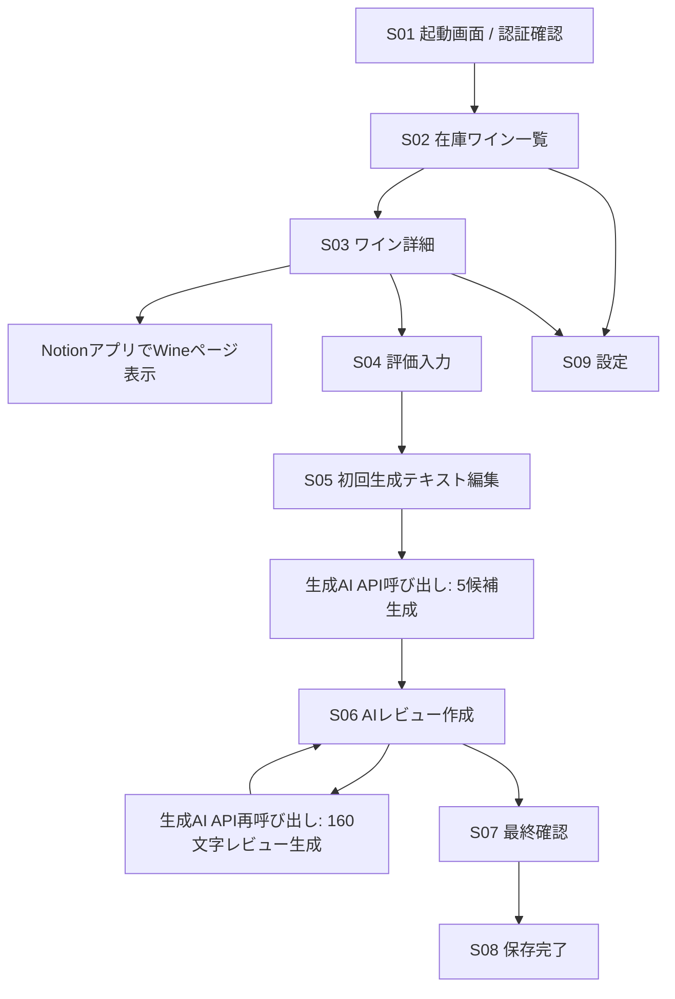

# Wine Review ユニバーサルアプリ仕様書

## 1. 概要

### 1.1 目的

NotionのWine Tracker DBに登録されている在庫ワインからレビュー対象を選び、生成AIとの対話を通じてレビューコメントを作成し、最終的な評価・コメント・在庫状態をNotionのWineページへ書き戻す、iPhoneとiPadで動作するユニバーサルアプリを提供する。

### 1.2 想定ユーザー

- Notionでワイン在庫を管理している個人ユーザー
- 飲んだワインの記録を、簡単なメモから自然なレビュー文へ整えたいユーザー
- 評価、在庫消費、コメント記録をiPhoneまたはiPad上で完結したいユーザー

### 1.3 対象プラットフォーム

- iPhone / iPad
- iOS / iPadOS
- Swift / SwiftUI想定
- Notion API連携
- 生成AI API連携

### 1.4 本仕様の前提

Notion上にWine Tracker DBが存在し、各Wineページには少なくとも以下のプロパティがある前提とする。

| プロパティ | 型 | 用途 |
| --- | --- | --- |
| Name / Title | title | ワイン名 |
| Stock | checkbox | 在庫有無 |
| Rating | select または rich_text | 評価 |
| Type | select | 赤、白、泡など |
| Country | select | 生産国 |
| Region | select | 生産地域 |
| Cave | select | 購入店、保管場所、販売店など |
| Cepage | multi_select | 品種 |
| Price | number | 価格 |
| Detail | rich_text | 既存のメモ、味わい情報 |
| tasting date | date | 試飲日 |
| Purchase date | date | 購入日 |
| Comments | Notionコメントまたはページ本文 | レビューコメントの書き込み先 |

実際のNotion DBプロパティ名が異なる場合に備え、初期設定画面でプロパティマッピングを変更できる設計が望ましい。

## 2. ユースケース

1. ユーザーがアプリを起動する。
2. アプリがNotionのWine Tracker DBから`Stock = true`のワインを取得する。
3. ユーザーがレビュー対象のワインを選択する。
4. アプリがワイン詳細を表示する。
5. ユーザーがRatingと評価情報を入力する。
6. アプリが定型テキスト1を初期テキストとして提示し、ユーザーが初期コメントを追加する。
7. アプリが6のテキストで生成AI APIを呼び出す。
8. アプリが最初のレビューコメント案を表示する。
9. アプリが定型テキスト2を初期テキストとして提示し、ユーザーがフィードバックを追加する。
10. アプリが7の生成結果と9のテキストを合わせて、生成AI APIを再呼び出しする。
11. 必要に応じて9から10を繰り返す。
12. ユーザーが最終コメントを確定する。
13. アプリがNotionのWineページにコメントを書き戻す。
14. アプリがRatingを更新し、`Stock`のチェックを外す。
15. 完了画面を表示する。

## 3. 画面構成

### 3.1 画面一覧

| 画面ID | 画面名 | 役割 |
| --- | --- | --- |
| S01 | 起動画面 / 認証確認 | Notion/API設定状態を確認 |
| S02 | 在庫ワイン一覧 | 在庫ありワインの表示、検索、選択 |
| S03 | ワイン詳細 | Notionページ情報の表示、Notionアプリ起動 |
| S04 | 評価入力 | Rating、試飲日、在庫消費の入力 |
| S05 | 初回生成テキスト編集 | 定型テキスト1を初期表示し、ユーザーが初期コメントを追記 |
| S06 | AIレビュー作成 | 5つの説明候補表示、定型テキスト2への追記、160文字レビュー生成 |
| S07 | 最終確認 | Rating、Stock変更、コメント内容の保存前確認 |
| S08 | 保存完了 | Notion書き戻し結果の表示 |
| S09 | 設定 | Notion DB ID、APIキー、プロパティマッピング、定型文管理 |

### 3.2 画面遷移



## 4. 各画面仕様

### 4.1 S01 起動画面 / 認証確認

#### 表示項目

- アプリ名
- Notion連携状態
- 生成AI API設定状態
- 初回設定への導線
- 同期中インジケータ

#### 処理

- Notion APIキー、Wine Tracker DB ID、OpenAI/Geminiの生成AI APIキー、利用する生成AIプロバイダは、アプリの設定画面で保存したローカル設定から読み込む。
- 定型テキストの初期値は、アプリに同梱する`AppDefaults.env`から読み込む。
- `.env`はローカル開発用の非公開ファイルとして扱い、アプリのResourceには含めない。
- 必須設定が揃っていればS02へ遷移する。
- 未設定項目があればS09へ遷移する。

### 4.2 S02 在庫ワイン一覧

#### 目的

NotionのWine Tracker DBから在庫ありのワインを表示し、レビュー対象を選択する。

#### 表示項目

- ワイン名
- Type
- Country
- Region
- Cepage
- Rating
- Price
- Purchase date
- Detailの冒頭
- 検索バー
- 並び替えメニュー
- 更新ボタン

#### 取得条件

Notion APIのDatabase queryで以下を指定する。

- `Stock` checkbox equals `true`
- 任意でソート:
  - `Purchase date` descending
  - `Name` ascending

#### 操作

- ワイン行をタップ: S03へ遷移
- 検索: ローカルに取得済みデータをフィルタ
- 更新: Notion DBを再取得
- 設定: S09へ遷移

#### 空状態

- 在庫ありワインがない場合:
  - 「在庫ありのワインがありません」
  - 再読み込みボタン
  - 設定画面への導線

### 4.3 S03 ワイン詳細

#### 目的

選択したWineページの内容を確認し、レビュー作成に進む。

#### 表示項目

- ワイン名
- ページアイコンまたは国旗アイコン
- Type、Country、Region、Cave、Cepage
- Rating
- Price
- Detail
- tasting date
- Purchase date
- Stock
- 既存Commentsまたはページ本文の抜粋

#### 操作

- 「レビューを作成」: S04へ遷移
- 「Notionで開く」: Notionアプリまたはブラウザで対象ページを開く
- 「再読み込み」: 対象ページを再取得
- 「一覧に戻る」: S02へ戻る

#### Notionアプリ表示方針

アプリ内表示を基本としつつ、Notionアプリへのディープリンクも提供する。

- Notionアプリがインストール済み: Notionアプリでページを開く
- 未インストール: ブラウザでNotionページURLを開く
- URLが取得できない: エラー表示

### 4.4 S04 評価入力

#### 目的

レビュー保存時にNotionへ反映する評価情報を入力する。

#### 表示項目

- ワイン名
- 現在のRating
- Rating入力
- 評価補足入力
- tasting date入力
- `Stock`を在庫なしに変更するトグル

#### Rating入力形式

Notion DBの型に合わせる。

- select型の場合: `★`, `★★`, `★★★`, `★★★★`, `★★★★★`などの選択肢
- rich_text型の場合: 任意テキスト入力
- number型の場合: 0.5刻みまたは1刻みの数値入力

#### 操作

- 「次へ」: S05へ遷移
- 「戻る」: S03へ戻る

#### 初期値

- Rating: Notion上の現在値
- tasting date: 今日の日付
- Stock変更: オン、つまり保存時に`Stock = false`へ変更する

### 4.5 S05 初回生成テキスト編集

#### 目的

アプリが定型テキスト1を初期テキストとして提示し、ユーザーが感じた味、香り、印象、料理との相性などを追記する。

#### 表示項目

- ワイン概要
- 定型テキスト1が入力済みの初期コメント入力欄
- レビュー文体選択
- 文字数目安
- 定型テキスト1の編集導線

#### 入力例

- 香り: フルーティー、ハーブ、樽香など
- 味わい: 酸味、甘み、苦味、余韻、軽さ、重さ
- 印象: 飲みやすい、食事向き、リピートしたい
- ペアリング: 和食、魚、肉、チーズなど

#### 操作

- 「AIでレビュー案を作成」: S06へ遷移し、初回AI生成を実行
- 「戻る」: S04へ戻る

### 4.6 S06 AIレビュー作成

#### 目的

生成AIを使ってテイスティング評価の説明候補を5つ作成し、ユーザーが選んだ候補や要素をもとに160文字程度のレビューコメントへまとめる。

#### 表示項目

- 現在のレビューコメント案
- フィードバック入力欄
- 再生成ボタン
- 直接編集ボタン
- 採用ボタン
- 5つの説明候補
- 候補選択または`＜＞`指定入力欄
- 生成履歴
- API呼び出し中インジケータ

#### 初回生成

以下をプロンプトに含める。

- ワイン情報
- Rating
- 評価補足
- 定型テキスト1を初期値としてユーザーが追記した初期コメント全文

出力は、ワイン中級者が販売店ソムリエに評価を伝える場面を想定した、良い評価として使える説明候補5つとする。

#### 再生成

以下をプロンプトに含める。

- ワイン情報
- Rating
- 初回生成された5つの説明候補
- 定型テキスト2を初期値としてユーザーが追記したフィードバック全文
- 過去の改善履歴の要約

出力は、指定された候補や要素をまとめた160文字程度のレビューコメントとする。

#### 操作

- 「5候補を再生成」: 生成AI APIを再呼び出し、説明候補を作り直す
- 「選択してまとめる」: 選択候補または`＜＞`内の指定を使って160文字程度のレビューコメントを作成
- 「短く」: フィードバックプリセットとして短文化
- 「詳しく」: フィードバックプリセットとして情報追加
- 「自然に」: フィードバックプリセットとして文体調整
- 「直接編集」: コメント案をテキストエディタで編集
- 「これで確定」: S07へ遷移
- 「戻る」: S05へ戻る

#### 再生成上限

初期値は1レビューあたり10回までとする。設定画面で変更可能にする。

### 4.7 S07 最終確認

#### 目的

Notionへ書き戻す内容を保存前に確認する。

#### 表示項目

- ワイン名
- 更新後Rating
- Stock更新内容
- tasting date
- 最終コメント
- Notion書き込み先

#### 操作

- 「Notionへ保存」: Notion API更新を実行
- 「コメントを編集」: S06へ戻る
- 「評価を編集」: S04へ戻る
- 「キャンセル」: 確認ダイアログ表示後、S03へ戻る

#### 保存時処理

1. Notionページのプロパティを更新する。
   - Rating
   - tasting date
   - Stock
2. 最終コメントを書き込む。
3. 成功したらS08へ遷移する。
4. 一部失敗した場合は、成功・失敗の内訳を表示し、再試行を可能にする。

### 4.8 S08 保存完了

#### 表示項目

- 保存完了メッセージ
- 保存したコメントの抜粋
- Notionで開くボタン
- 在庫一覧へ戻るボタン
- 次のワインをレビューするボタン

#### 操作

- 「Notionで開く」: 対象Wineページを開く
- 「一覧へ」: S02へ戻る
- 「次のレビュー」: S02へ戻り、最新の在庫あり一覧を再取得

### 4.9 S09 設定

#### 表示項目

- Notion APIキー読み込み状態
- Wine Tracker DB ID読み込み状態
- 生成AIプロバイダ選択状態
- OpenAI APIキー、モデル読み込み状態
- Gemini APIキー、モデル読み込み状態
- Notionプロパティマッピング
- 定型テキスト1
- 定型テキスト2
- デフォルト文体
- 再生成回数上限

#### 保存先

- Notion APIキー、Wine Tracker DB ID、OpenAI APIキー、OpenAIモデル、Gemini APIキー、Geminiモデル、生成AIプロバイダ: UserDefaultsを用いたアプリ内ローカル設定
- プロパティマッピング、文体設定、定型文のユーザー編集値: UserDefaultsまたはローカル設定ファイル
- 定型テキストの出荷時初期値: `AppDefaults.env`
- `.env`: ローカル開発用の非公開ファイル。アプリのResourceには含めず、Git管理対象にも含めない。

## 5. Notion連携仕様

### 5.1 認証

Notion Integration Tokenを使用する。

- トークンは設定画面で入力し、アプリ内ローカル設定に保存する。
- Wine Tracker DB IDは設定画面で入力し、アプリ内ローカル設定に保存する。
- `.env`はローカル開発用の秘密情報ファイルとして扱い、Git管理対象に含めない。
- `.env`はアプリのResourceには含めない。アプリに同梱してよい設定は、秘密情報を含まない`AppDefaults.env`に限定する。
- Wine Tracker DBをNotion Integrationに共有しておく必要がある。
- 初回設定時にDB接続テストを行う。

#### .env例

`.env`はローカル開発時の控えとしてのみ使用する。値は設定画面へ入力し、アプリには同梱しない。

```dotenv
NOTION_API_KEY=your_notion_api_key
NOTION_WINE_TRACKER_DATABASE_ID=your_wine_tracker_database_id

# OpenAI
OPENAI_API_KEY=your_openai_api_key
OPENAI_MODEL=gpt-4.1-mini

# Gemini
GEMINI_API_KEY=your_gemini_api_key
GEMINI_MODEL=gemini-1.5-pro

# AI provider selection: openai or gemini
GENAI_PROVIDER=openai
```

#### AppDefaults.env例

`AppDefaults.env`は秘密情報を含まない出荷時初期値としてアプリに同梱できる。

```dotenv
WINE_REVIEW_TEMPLATE_1=このワインのテースティングの良い評価として5つの説明候補をあげてください
WINE_REVIEW_TEMPLATE_2=コメント案をまとめて160文字くらいのレビューコメントにしてください。
```

### 5.2 在庫一覧取得

#### API

`POST /v1/databases/{database_id}/query`

#### フィルタ

```json
{
  "filter": {
    "property": "Stock",
    "checkbox": {
      "equals": true
    }
  }
}
```

#### ページング

- `has_more = true`の場合は`next_cursor`で追加取得する。
- 初期表示は最大50件を取得し、必要に応じて追加読み込みする。

### 5.3 Wineページ取得

#### API

- `GET /v1/pages/{page_id}`
- 必要に応じて`GET /v1/blocks/{block_id}/children`

#### 取得内容

- DBプロパティ
- ページURL
- ページ本文の一部
- 既存コメントまたは本文内コメント欄相当の内容

### 5.4 ページプロパティ更新

#### API

`PATCH /v1/pages/{page_id}`

#### 更新対象

- `Rating`
- `tasting date`
- `Stock`

#### 例

```json
{
  "properties": {
    "Rating": {
      "select": {
        "name": "★★★★"
      }
    },
    "tasting date": {
      "date": {
        "start": "2026-04-22"
      }
    },
    "Stock": {
      "checkbox": false
    }
  }
}
```

### 5.5 コメント書き込み

Notion APIの制約と運用方針により、以下のいずれかを選択する。

#### 案A: Notionページのコメント機能に書き込む

- Notion APIでコメント作成が利用可能な場合、対象ページにコメントとして投稿する。
- UI上の`Comments`欄に表示されることを重視する場合に適する。

#### 案B: ページ本文末尾にReviewブロックを追加する

- `PATCH /v1/blocks/{block_id}/children`
- 見出し「Review」または日付付きの段落を追加する。
- API実装が安定しやすい。

#### 案C: DBプロパティとして`Comment`または`Review Comment`を追加する

- 検索、一覧表示、再編集がしやすい。
- 長文の場合はrich_textの制限に注意する。

#### 推奨

初期実装では案Bまたは案Cを推奨する。ユーザー要件としてNotionのコメント欄そのものへの投稿が必須の場合は案Aを採用する。

## 6. 生成AI連携仕様

### 6.1 生成AI API設定

設定画面で以下を管理する。

- 生成AIプロバイダ
- OpenAI APIキー
- OpenAIモデル
- Gemini APIキー
- Geminiモデル
- temperature
- 最大出力トークン数
- システム指示文

生成AIプロバイダは`openai`または`gemini`を指定する。レビュー生成時は設定画面で保存されたプロバイダ、APIキー、モデルを使用する。未指定の場合は`openai`を既定値とする。

ローカル開発用の`.env`はアプリに同梱しない。定型テキストの初期値だけを`AppDefaults.env`から読み込み、ユーザーが設定画面で編集した値はローカル設定に保存する。

### 6.2 定型テキスト

#### 定型テキスト1: 初回レビュー作成用

目的: ユーザーの断片的なメモとワイン情報をもとに、良い評価として使えるテイスティング説明候補を5つ作成する。

例:

```text
このワインのテースティングの良い評価として５つの説明候補をあげてください
言い振りは、ワイン中級者が販売店ソムリエに評価をつたえるためのレビューにしてください
```

#### 定型テキスト2: 最終レビュー要約用

目的: 初回生成された候補とユーザーのフィードバックをまとめ、Notionへ保存するレビューコメントに整える。

例:

```text
コメント案をまとめて160文字くらいのレビューコメントにしてください。
```

### 6.3 初回生成プロンプト構成

```text
ワイン情報:
- 名前: {name}
- 種類: {type}
- 国: {country}
- 地域: {region}
- 品種: {cepage}
- 価格: {price}
- 既存メモ: {detail}

評価:
- Rating: {rating}
- 評価補足: {rating_note}

初回生成用テキスト:
{template_1_and_user_initial_comment}
```

### 6.4 再生成プロンプト構成

```text
ワイン情報:
{wine_summary}

初回生成された5つの説明候補:
{candidate_comments}

再生成用テキスト:
{template_2_and_user_feedback}
```

### 6.5 出力制約

- 日本語
- 初回生成は5つの説明候補
- 最終レビューは160文字程度
- Notionにそのまま貼れる文章
- 最終レビューではMarkdown見出しや箇条書きは使わない
- 不明な情報を断定しない
- ワイン名、生産者、品種などを誤って補完しない

## 7. データモデル

### 7.1 Wine

```swift
struct Wine: Identifiable {
    let id: String
    let notionPageId: String
    let notionUrl: URL?
    let name: String
    let type: String?
    let rating: String?
    let country: String?
    let region: String?
    let cave: String?
    let cepage: [String]
    let price: Int?
    let detail: String?
    let tastingDate: Date?
    let purchaseDate: Date?
    let stock: Bool
}
```

### 7.2 ReviewSession

```swift
struct ReviewSession: Identifiable {
    let id: UUID
    let wine: Wine
    var rating: String?
    var ratingNote: String
    var tastingDate: Date
    var markOutOfStock: Bool
    var initialComment: String
    var drafts: [ReviewDraft]
    var finalComment: String?
}
```

### 7.3 ReviewDraft

```swift
struct ReviewDraft: Identifiable {
    let id: UUID
    let text: String
    let feedback: String?
    let createdAt: Date
    let generationIndex: Int
}
```

### 7.4 AppSettings

```swift
struct AppSettings {
    var notionDatabaseId: String
    var aiModel: String
    var propertyMapping: NotionPropertyMapping
    var template1: String
    var template2: String
    var maxRegenerationCount: Int
}
```

## 8. エラー処理

### 8.1 Notion APIエラー

| 状況 | 表示 | ユーザー操作 |
| --- | --- | --- |
| Token不正 | Notion連携を確認してください | 設定画面へ |
| DB未共有 | Wine Tracker DBがIntegrationに共有されていません | Notion設定手順を表示 |
| プロパティ不一致 | Stockプロパティが見つかりません | プロパティマッピングを開く |
| ページ更新失敗 | Notionへの保存に失敗しました | 再試行 |
| レート制限 | しばらく待って再試行してください | 再試行 |

### 8.2 生成AI APIエラー

| 状況 | 表示 | ユーザー操作 |
| --- | --- | --- |
| APIキー不正 | 生成AI APIキーを確認してください | 設定画面へ |
| ネットワーク失敗 | 通信に失敗しました | 再試行 |
| 出力が空 | コメント案を作成できませんでした | 再生成 |
| レート制限 | 少し待ってから再生成してください | 再試行 |

### 8.3 保存時の部分失敗

Notionへの保存は複数操作に分かれるため、部分失敗を考慮する。

- Rating更新成功、コメント書き込み失敗
- コメント書き込み成功、Stock更新失敗
- tasting date更新のみ失敗

この場合、成功済み項目と失敗項目を明示し、失敗項目のみ再試行できるようにする。

## 9. セキュリティ

- Notion APIキー、Wine Tracker DB ID、OpenAI APIキー、OpenAIモデル、Gemini APIキー、Geminiモデル、生成AIプロバイダはアプリ内ローカル設定に保存する。
- `.env`はローカル開発用の秘密情報ファイルとしてのみ扱い、Git管理対象外とし、アプリのResourceにも含めない。
- `.env.example`は共有してよいが、実キーに見える値は書かない。
- `AppDefaults.env`には非秘密の定型テキスト初期値だけを置き、APIキーやDB IDを含めない。
- APIキーをログに出力しない。
- 生成AI APIへ送信する情報は、レビュー作成に必要なWine情報とユーザー入力に限定する。
- Notionページ本文を送信する場合は、送信前にユーザーが確認できる設計にする。
- デバッグログではワイン名やコメント本文をマスクできる設定を用意する。

## 10. 非機能要件

### 10.1 パフォーマンス

- 在庫一覧の初期表示は3秒以内を目標とする。
- Notion DBが大きい場合はページング取得する。
- 取得済み一覧は短時間キャッシュし、手動更新で最新化する。

### 10.2 オフライン対応

- オフライン時は直近取得済みの在庫一覧を閲覧可能にする。
- AI生成とNotion保存はオンライン必須。
- 保存前のReviewSessionはローカルに一時保存し、通信復帰後に再開可能にする。

### 10.3 アクセシビリティ

- Dynamic Type対応
- VoiceOverでワイン名、Rating、Stock状態が分かるラベルを設定
- 色だけでRatingや保存状態を表現しない

### 10.4 ローカライズ

初期版は日本語のみ。将来的に英語レビュー出力を選択可能にする。

## 11. 実装フェーズ案

### Phase 1: 最小実用版

- 設定画面
- Notion DBから`Stock = true`の一覧取得
- ワイン詳細表示
- Rating入力
- 初回生成テキスト編集
- AI初回生成
- 最終コメントのNotion書き戻し
- Stockをfalseへ更新

### Phase 2: 対話改善

- フィードバックによる再生成
- 生成履歴
- 直接編集
- 部分失敗時の再試行
- Notionアプリで開く導線

### Phase 3: 使い勝手向上

- プロパティマッピングUI
- 定型テキスト編集
- キャッシュ
- オフライン下書き
- レビュー文体プリセット
- 複数DB対応

## 12. 未確定事項

実装前に以下を確認する。

1. `Rating`プロパティのNotion型と選択肢
2. レビューコメントを書き込む先がNotionのコメント欄か、ページ本文か、DBプロパティか
3. `Comments`欄をNotion APIで確実に更新できるか
4. `評価`プロパティと`Rating`プロパティの役割の違い
5. Notionページ本文のどこまでをAIプロンプトに含めるか
6. 使用する生成AI APIとモデル
7. レビュー文体の標準スタイル
8. Stockを保存時に必ずfalseへ変更するか、ユーザー確認制にするか

## 13. 受け入れ基準

- 在庫ありのWineだけが一覧に表示される。
- Wineを選択すると、主要なNotionプロパティがアプリ内で確認できる。
- Notionアプリまたはブラウザで対象Wineページを開ける。
- Ratingと試飲日を入力できる。
- 初期コメントからAIレビュー案を生成できる。
- フィードバックを入力してレビュー案を再生成できる。
- 最終コメントをユーザーが直接編集できる。
- 保存時にNotionページへ最終コメントが反映される。
- 保存時にRatingが反映される。
- 保存時に`Stock`がfalseへ更新される。
- APIエラー時にユーザーが再試行または設定変更できる。
