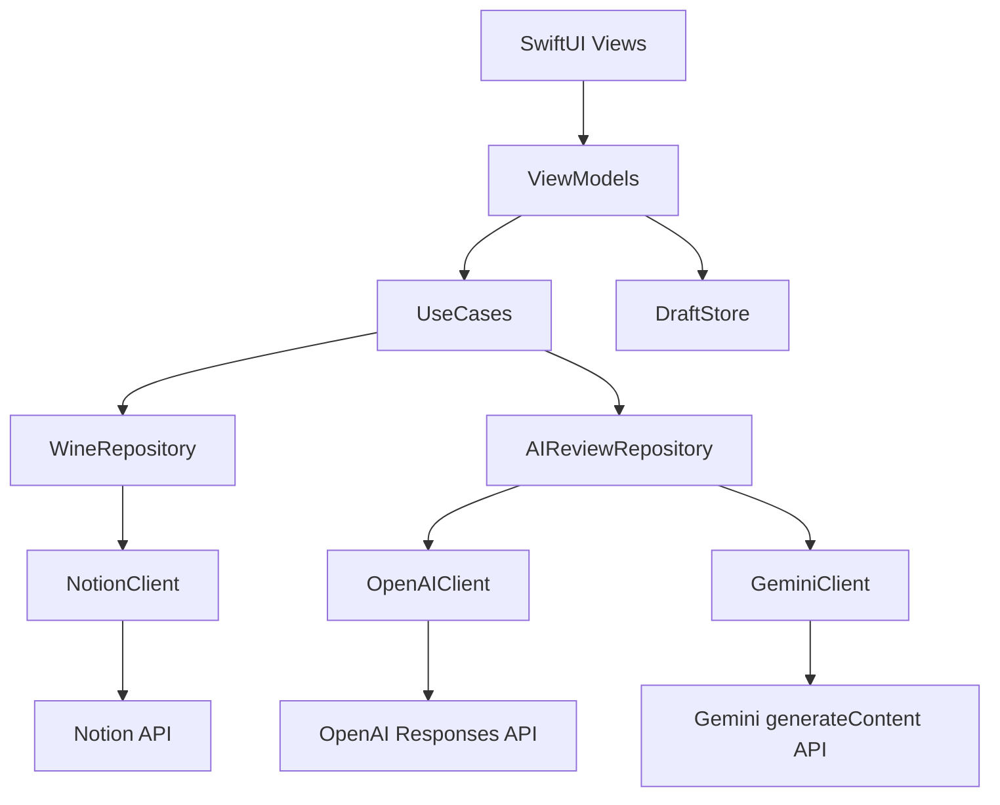

# Wine Review ユニバーサルアプリ 技術説明書

## 1. 目的

この文書は、`docs/wine-review-ios-app-spec.md` のアプリ仕様を実装するための技術設計をまとめる。対象はSwift / SwiftUIで作る、iPhoneとiPadで動作するユニバーサルアプリで、NotionのWine Tracker DBから在庫ワインを取得し、OpenAIまたはGeminiを切り替えてレビュー案を生成し、最終コメント・Rating・Stock状態をNotionへ書き戻す。

## 2. 技術スタック

| 領域 | 採用技術 | 用途 |
| --- | --- | --- |
| UI | SwiftUI | 画面構築、画面遷移 |
| 状態管理 | `ObservableObject` / `@StateObject` / `@Published` | 画面状態、レビューセッション管理 |
| 非同期処理 | Swift Concurrency | API呼び出し、ページング、保存処理 |
| HTTP通信 | `URLSession` | Notion / OpenAI / Gemini REST API呼び出し |
| 設定値 | `UserDefaults`、`AppDefaults.env` | APIキー、DB ID、モデル、プロバイダ、非秘密の定型テキスト初期値 |
| ローカル保存 | `UserDefaults`、必要ならSwiftData | プロパティマッピング、定型文のユーザー編集値、下書き |
| JSON | `Codable` | APIリクエスト/レスポンス変換 |
| テスト | XCTest | APIクライアント、Repository、ViewModelの単体テスト |

## 3. 全体アーキテクチャ

アプリはUI、UseCase、Repository、API Clientを分離する。



### 3.1 レイヤ責務

| レイヤ | 責務 |
| --- | --- |
| View | 表示、入力、ボタン操作、ローディング/エラー表示 |
| ViewModel | 画面状態、入力検証、UseCase呼び出し |
| UseCase | ユースケース単位の処理順序、部分失敗制御 |
| Repository | ドメインモデルと外部API/ローカル保存の橋渡し |
| API Client | HTTPリクエスト、認証ヘッダ、レスポンス解析 |
| Store | `AppDefaults.env`、UserDefaults、下書きキャッシュの読み書き |

## 4. ディレクトリ構成案

```text
WineReview/
  App/
    WineReviewApp.swift
    AppContainer.swift
  Config/
    EnvLoader.swift
    AppConfig.swift
  Domain/
    Models/
      Wine.swift
      ReviewSession.swift
      ReviewDraft.swift
      AppSettings.swift
      NotionPropertyMapping.swift
    Errors/
      AppError.swift
  Data/
    Notion/
      NotionClient.swift
      NotionWineRepository.swift
      NotionDTO.swift
    AI/
      AIReviewRepository.swift
      AIProvider.swift
      OpenAIClient.swift
      GeminiClient.swift
      AIDTO.swift
    Local/
      SettingsStore.swift
      DraftStore.swift
  UseCases/
    LoadInventoryWinesUseCase.swift
    LoadWineDetailUseCase.swift
    GenerateReviewCandidatesUseCase.swift
    GenerateFinalReviewUseCase.swift
    SaveReviewToNotionUseCase.swift
  Presentation/
    Inventory/
    WineDetail/
    RatingInput/
    InitialPromptEditor/
    AIReview/
    FinalConfirmation/
    Settings/
  Tests/
```

## 5. 設定とAppDefaults.env

### 5.1 設定の責務分担

| 種類 | 保存場所 | アプリ同梱 | 用途 |
| --- | --- | --- | --- |
| Notion APIキー、Wine Tracker DB ID | UserDefaultsを用いたアプリ内ローカル設定 | しない | Notion連携 |
| OpenAI/Gemini APIキー、モデル、生成AIプロバイダ | UserDefaultsを用いたアプリ内ローカル設定 | しない | レビュー生成 |
| プロパティマッピング、文体設定、定型文のユーザー編集値 | UserDefaultsまたはローカル設定ファイル | しない | ユーザー設定 |
| 定型文の出荷時初期値 | `AppDefaults.env` | する | 初期表示、設定リセット |
| ローカル開発用の控え | `.env` | しない | 開発者の手元の設定メモ |

`.env`は秘密情報を含み得るため、Git管理対象にもXcodeのResource参照にも含めない。アプリに同梱する設定ファイルは、秘密情報を含まない`AppDefaults.env`に限定する。

### 5.2 AppDefaults.env形式

```dotenv
WINE_REVIEW_TEMPLATE_1=このワインのテースティングの良い評価として5つの説明候補をあげてください
WINE_REVIEW_TEMPLATE_2=コメント案をまとめて160文字くらいのレビューコメントにしてください。
```

`AppDefaults.env`にはAPIキー、DB ID、実ユーザーの情報を置かない。`EnvLoader`はこのファイルを読み込み、定型文初期値を`AppSettings`へ反映する。ユーザーが設定画面で定型文を編集した後は、ローカル設定の値を優先する。

### 5.3 ローカル開発用.env形式

`.env`は開発者の手元で設定値を控えるためのファイルであり、アプリバンドルへ含めない。必要なキー名は`.env.example`で共有するが、実キーに見える値は書かない。

```dotenv
NOTION_API_KEY=your_notion_api_key
NOTION_WINE_TRACKER_DATABASE_ID=your_wine_tracker_database_id

# OpenAI
OPENAI_API_KEY=your_openai_api_key
OPENAI_MODEL=gpt-4.1-mini

# Gemini
GEMINI_API_KEY=your_gemini_api_key
GEMINI_MODEL=gemini-1.5-pro

# AI provider selection: openai or gemini
GENAI_PROVIDER=openai
```

### 5.4 AppConfig

```swift
struct AppConfig {
    let notionApiKey: String
    let notionWineTrackerDatabaseId: String
    let openAIAPIKey: String?
    let openAIModel: String?
    let geminiAPIKey: String?
    let geminiModel: String?
    let aiProvider: AIProvider
}

enum AIProvider: String {
    case openai
    case gemini
}
```

`SettingsStore`は保存済みの`AppSettings`から`AppConfig`を構成する。API呼び出し時は`AppConfig`の値を使用し、未設定の必須値がある場合は設定画面へ誘導する。

### 5.5 読み込みと保存方針

- 起動時に`AppDefaults.env`を`Bundle.main`から読み込み、定型テキスト初期値として使う。
- ユーザーが設定画面で保存したAPIキー、DB ID、モデル、プロバイダ、定型文はUserDefaultsから読み込む。
- UserDefaultsに定型文のユーザー編集値が存在する場合は、`AppDefaults.env`より優先する。
- 既存レビューセッションの最終レビュー用プロンプトが旧デフォルト値のまま未編集であれば、現在の定型テキスト2へ更新する。
- `.env`、`.env.*`、`Config.generated.xcconfig`はGit管理対象外にする。`.env.example`のみ共有する。
- XcodeプロジェクトのResource参照には`.env`を追加しない。

### 5.6 セキュリティ注意

iPhone/iPadアプリのローカル保存値は端末上で抽出される可能性がある。個人利用MVPでは許容範囲として扱うが、公開配布する場合はバックエンドプロキシを立て、Notion / OpenAI / GeminiのAPIキーをサーバ側に置く。少なくとも、`.env`やAPIキー入りファイルをアプリバンドルへ含めてはならない。

## 6. ドメインモデル

### 6.1 Wine

```swift
struct Wine: Identifiable, Equatable {
    let id: String
    let notionPageId: String
    let notionUrl: URL?
    let name: String
    let type: String?
    let rating: String?
    let country: String?
    let region: String?
    let cave: String?
    let cepage: [String]
    let price: Int?
    let detail: String?
    let tastingDate: Date?
    let purchaseDate: Date?
    let stock: Bool
}
```

### 6.2 ReviewSession

```swift
struct ReviewSession: Identifiable, Codable {
    let id: UUID
    var wineId: String
    var rating: String
    var ratingNote: String
    var tastingDate: Date
    var markOutOfStock: Bool
    var initialGenerationText: String
    var tastingInput: TastingInput?
    var candidateComments: [String]
    var finalGenerationText: String
    var drafts: [ReviewDraft]
    var finalComment: String
}
```

### 6.3 TastingInput

```swift
struct TastingInput: Codable, Equatable {
    let wineType: String
    let sliders: [String: Int]
    let impressionTags: [String]
    let foodPairingTags: [String]
    let freeNote: String
}
```

### 6.4 ReviewDraft

```swift
struct ReviewDraft: Identifiable, Codable, Equatable {
    let id: UUID
    let text: String
    let feedbackText: String?
    let provider: AIProvider
    let model: String
    let createdAt: Date
    let generationIndex: Int
}
```

### 6.5 S05の入力制御

S05ではNotionから取得した`Wine.type`をもとに`TastingProfile`を決定し、表示するスライダーと印象タグを切り替える。

- スライダーは各タイプ最大7項目、値は1から5、初期値は3
- 印象タグは最大3個
- 料理相性タグは最大2個で、初期状態は折りたたみ
- 自由メモは任意

既存のドラフト保存との互換性を保つため、`ReviewSession`の`Codable`復元では追加フィールドを`decodeIfPresent`で読み込む。

## 7. 画面とViewModel

### 7.1 画面対応

| 仕様画面 | View | ViewModel |
| --- | --- | --- |
| S01 起動画面 / 認証確認 | `LaunchView` | `LaunchViewModel` |
| S02 在庫ワイン一覧 | `InventoryWineListView` | `InventoryWineListViewModel` |
| S03 ワイン詳細 | `WineDetailView` | `WineDetailViewModel` |
| S04 評価入力 | `RatingInputView` | `RatingInputViewModel` |
| S05 テースティング入力・レビュー生成準備 | `InitialPromptEditorView` | `InitialPromptEditorViewModel` |
| S06 AIレビュー作成 | `AIReviewView` | `AIReviewViewModel` |
| S07 最終確認 | `FinalConfirmationView` | `FinalConfirmationViewModel` |
| S08 保存完了 | `SaveCompleteView` | `SaveCompleteViewModel` |
| S09 設定 | `SettingsView` | `SettingsViewModel` |

### 7.2 ナビゲーション

SwiftUIの`NavigationStack`を使う。画面遷移は`AppRoute`で型安全に扱う。

```swift
enum AppRoute: Hashable {
    case inventory
    case wineDetail(wineId: String)
    case ratingInput(wineId: String)
    case initialPrompt(sessionId: UUID)
    case aiReview(sessionId: UUID)
    case finalConfirmation(sessionId: UUID)
    case saveComplete(pageId: String)
    case settings
}
```

### 7.3 主要状態

| ViewModel | 主な状態 |
| --- | --- |
| `InventoryWineListViewModel` | `wines`, `searchText`, `isLoading`, `error` |
| `RatingInputViewModel` | `rating`, `ratingNote`, `tastingDate`, `markOutOfStock` |
| `InitialPromptEditorViewModel` | `initialGenerationText`, `sliderValues`, `selectedImpressionTags`, `selectedFoodPairingTags`, `freeNote`, `isGenerating` |
| `AIReviewViewModel` | `candidateComments`, `finalGenerationText`, `drafts`, `finalComment`, `isGenerating` |
| `FinalConfirmationViewModel` | `saveState`, `partialFailures`, `canRetry` |

## 8. Notion連携設計

### 8.1 Notion APIバージョン

Notionは2025-09-03以降、DatabaseとData Sourceの概念が分割されている。仕様書ではWine Tracker DBと呼ぶが、技術的には`NotionWineRepository`でAPI差分を隠蔽する。

| 選択肢 | エンドポイント | 用途 |
| --- | --- | --- |
| 旧Database API | `POST /v1/databases/{database_id}/query` | `Notion-Version: 2022-06-28`で使う既存実装 |
| 新Data Source API | `POST /v1/data_sources/{data_source_id}/query` | `Notion-Version: 2025-09-03`以降の推奨実装 |

MVPでは現在のNotion設定に合わせてどちらかを選ぶ。アプリ内部では`queryStockWines()`というRepositoryメソッドに閉じ込める。

### 8.2 NotionClient

```swift
protocol NotionClientProtocol {
    func queryStockWines(startCursor: String?) async throws -> NotionPageListResponse
    func retrievePage(pageId: String) async throws -> NotionPageResponse
    func retrieveBlockChildren(blockId: String, startCursor: String?) async throws -> NotionBlockListResponse
    func updatePageProperties(pageId: String, properties: [String: NotionPropertyUpdate]) async throws
    func appendReviewBlock(pageId: String, comment: String, tastingDate: Date) async throws
}
```

### 8.3 共通HTTPヘッダ

```text
Authorization: Bearer {NOTION_API_KEY}
Notion-Version: 2022-06-28 または 2025-09-03
Content-Type: application/json
```

### 8.4 在庫一覧取得

Repositoryは`Stock = true`でフィルタし、`has_more`が`true`なら`next_cursor`で追加取得する。

```json
{
  "filter": {
    "property": "Stock",
    "checkbox": {
      "equals": true
    }
  },
  "page_size": 50
}
```

### 8.5 プロパティマッピング

Notionのプロパティ名はユーザー側で変更される可能性があるため、内部では直接文字列を散らさない。

```swift
struct NotionPropertyMapping: Codable {
    var title: String = "Name"
    var stock: String = "Stock"
    var rating: String = "Rating"
    var type: String = "Type"
    var country: String = "Country"
    var region: String = "Region"
    var cave: String = "Cave"
    var cepage: String = "Cepage"
    var price: String = "Price"
    var detail: String = "Detail"
    var tastingDate: String = "tasting date"
    var purchaseDate: String = "Purchase date"
}
```

### 8.6 コメント保存方式

初期実装ではページ本文末尾へReviewブロックを追加する方式を推奨する。Notionのコメント欄そのものへの投稿はAPI仕様や権限に依存しやすいため、Repositoryのメソッドだけ差し替え可能にする。

```swift
enum ReviewWriteTarget: String, Codable {
    case pageBlock
    case databaseProperty
    case notionComment
}
```

本文末尾へ追加する場合のブロック例:

```json
{
  "children": [
    {
      "object": "block",
      "type": "heading_3",
      "heading_3": {
        "rich_text": [{ "type": "text", "text": { "content": "Review 2026-04-22" } }]
      }
    },
    {
      "object": "block",
      "type": "paragraph",
      "paragraph": {
        "rich_text": [{ "type": "text", "text": { "content": "{finalComment}" } }]
      }
    }
  ]
}
```

### 8.7 保存処理

`SaveReviewToNotionUseCase`は以下の順で実行する。

1. ページプロパティ更新
   - Rating
   - tasting date
   - Stock
2. コメント書き込み
3. 保存結果を`SaveResult`にまとめる
4. 部分失敗があれば、失敗した操作だけ再試行できる状態にする

```swift
struct SaveResult {
    var propertyUpdateSucceeded: Bool
    var commentWriteSucceeded: Bool
    var failures: [SaveFailure]
}
```

## 9. 生成AI連携設計

### 9.1 AIReviewRepository

OpenAIとGeminiを共通インターフェースで扱う。

```swift
protocol AIReviewRepositoryProtocol {
    func generateCandidates(input: ReviewGenerationInput) async throws -> [String]
    func generateFinalReview(input: FinalReviewGenerationInput) async throws -> String
}
```

```swift
struct ReviewGenerationInput {
    let wine: Wine
    let rating: String
    let ratingNote: String
    let initialGenerationText: String
    let tastingInput: TastingInput?
}

struct FinalReviewGenerationInput {
    let wine: Wine
    let rating: String
    let candidateComments: [String]
    let finalGenerationText: String
    let tastingInput: TastingInput?
}
```

### 9.2 プロバイダ切替

```swift
final class AIReviewRepository: AIReviewRepositoryProtocol {
    private let provider: AIProvider
    private let openAIClient: OpenAIClientProtocol
    private let geminiClient: GeminiClientProtocol

    func generateCandidates(input: ReviewGenerationInput) async throws -> [String] {
        switch provider {
        case .openai:
            return try await openAIClient.generateCandidates(input: input)
        case .gemini:
            return try await geminiClient.generateCandidates(input: input)
        }
    }
}
```

### 9.3 OpenAIClient

OpenAIはResponses APIを使う。エンドポイントは`POST https://api.openai.com/v1/responses`。

```json
{
  "model": "{OPENAI_MODEL}",
  "input": [
    {
      "role": "system",
      "content": "あなたはワインレビュー作成を支援する日本語編集者です。"
    },
    {
      "role": "user",
      "content": "{prompt}"
    }
  ],
  "temperature": 0.7,
  "max_output_tokens": 800
}
```

レスポンスは`output`配列内の`output_text`を抽出する。実装ではOpenAIのレスポンス構造をDTO化し、文字列抽出を1箇所に閉じ込める。

### 9.4 GeminiClient

Geminiは`models.generateContent`を使う。

```text
POST https://generativelanguage.googleapis.com/v1beta/models/{GEMINI_MODEL}:generateContent?key={GEMINI_API_KEY}
```

```json
{
  "contents": [
    {
      "role": "user",
      "parts": [
        {
          "text": "{prompt}"
        }
      ]
    }
  ],
  "generationConfig": {
    "temperature": 0.7,
    "maxOutputTokens": 800
  }
}
```

レスポンスは`candidates[].content.parts[].text`から抽出する。

### 9.5 プロンプト組み立て

プロンプト生成はAPI ClientではなくUseCaseまたは専用Builderに置く。

```swift
struct ReviewPromptBuilder {
    func candidatePrompt(input: ReviewGenerationInput) -> String
    func finalReviewPrompt(input: FinalReviewGenerationInput) -> String
}
```

初回生成:

```text
ワイン情報:
- 名前: {name}
- 種類: {type}
- 国: {country}
- 地域: {region}
- 品種: {cepage}
- 価格: {price}
- 既存メモ: {detail}

評価:
- Rating: {rating}
- 評価補足: {rating_note}

ユーザーのテースティング入力:
- ワインタイプ: {wine_type}
- スライダー評価:
  - {slider_name}: {slider_value}
- 印象タグ:
  {impression_tags}
- 料理相性:
  {food_pairing_tags}
- 自由メモ:
  {free_note}

初回生成用テキスト:
{template_1_and_user_initial_comment}
```

最終レビュー生成:

```text
ワイン情報:
{wine_summary}

ユーザーのテースティング入力:
{tasting_summary}

初回生成された5つの説明候補:
1. {candidate_1}
2. {candidate_2}
3. {candidate_3}
4. {candidate_4}
5. {candidate_5}

再生成用テキスト:
{template_2_and_user_feedback}
```

### 9.6 AI出力パース

初回生成では5候補が必要なため、AIには番号付きリストで出力させ、クライアントで行単位にパースする。パースに失敗した場合は全文を1候補として扱わず、ユーザーに再生成を促す。

```swift
struct CandidateParser {
    func parseFiveCandidates(from text: String) throws -> [String]
}
```

最終レビューは160文字程度の単一テキストとして扱う。前後の引用符、Markdown見出し、箇条書き記号は保存前に軽く除去する。

## 10. UseCase設計

### 10.1 LoadInventoryWinesUseCase

```swift
struct LoadInventoryWinesUseCase {
    let repository: NotionWineRepositoryProtocol

    func execute(forceRefresh: Bool) async throws -> [Wine]
}
```

処理:

1. キャッシュがあり`forceRefresh = false`ならキャッシュを返す
2. Notionから`Stock = true`のページを取得
3. DTOを`Wine`へ変換
4. 短時間キャッシュへ保存

### 10.2 GenerateReviewCandidatesUseCase

処理:

1. `ReviewSession.initialGenerationText`を検証
2. `ReviewPromptBuilder`でプロンプト作成
3. `AIReviewRepository.generateCandidates()`を呼ぶ
4. 5候補を`ReviewSession.candidateComments`へ保存
5. 生成履歴を`ReviewDraft`へ保存

### 10.3 GenerateFinalReviewUseCase

処理:

1. `ReviewSession.finalGenerationText`を検証
2. 初回生成結果と再生成用テキストを組み合わせる
3. 選択中のAIプロバイダへ送信
4. 結果を`ReviewSession.finalComment`へ保存

### 10.4 SaveReviewToNotionUseCase

処理:

1. 保存前検証
   - `pageId`がある
   - `finalComment`が空でない
   - RatingがNotion側の型に合う
2. Notionページプロパティ更新
3. コメント書き込み
4. 部分失敗を`SaveResult`として返す

## 11. エラー設計

```swift
enum AppError: LocalizedError {
    case missingConfig(String)
    case invalidEnvValue(String)
    case notionAPI(statusCode: Int, message: String)
    case aiAPI(provider: AIProvider, statusCode: Int, message: String)
    case network(URLError)
    case decoding(Error)
    case candidateParseFailed
    case partialSave([SaveFailure])
}
```

### 11.1 リトライ方針

| エラー | リトライ |
| --- | --- |
| ネットワーク一時失敗 | 可能 |
| 429レート制限 | 時間を置いて可能 |
| 5xx | 可能 |
| 401/403 | 設定修正が必要 |
| Notionプロパティ不一致 | プロパティマッピング修正が必要 |
| AI出力パース失敗 | 再生成 |

## 12. キャッシュと下書き

### 12.1 在庫一覧キャッシュ

- メモリキャッシュを基本とする。
- キャッシュ有効期限は5分。
- ユーザーの手動更新で破棄する。

### 12.2 ReviewSession下書き

レビュー作成途中でアプリが終了しても復帰できるように、`ReviewSession`をローカル保存する。

保存タイミング:

- Rating入力完了
- テースティング入力・レビュー生成準備
- 5候補生成後
- 最終レビュー生成後
- 直接編集後

保存先はMVPではUserDefaultsでよい。下書きが増える場合はSwiftDataへ移行する。

## 13. Notion URL起動

`Wine.notionUrl`がある場合は`UIApplication.shared.open(url)`で開く。

優先順:

1. Notionアプリで開けるURL
2. Web URL
3. URLなしの場合はエラー表示

NotionのURLスキームは環境差があるため、まずはNotion APIから取得できる`url`を開く実装にする。

## 14. テスト設計

### 14.1 単体テスト

| 対象 | テスト |
| --- | --- |
| `EnvLoader` | `AppDefaults.env`の読み込み、コメント行、空値、秘密情報キーを含めないこと |
| `NotionDTOMapper` | title/select/multi_select/date/checkboxの変換 |
| `ReviewPromptBuilder` | 初回生成、最終レビュー生成のプロンプト |
| `CandidateParser` | 5候補の正常パース、候補不足、番号ゆれ |
| `AIReviewRepository` | `GENAI_PROVIDER`によるOpenAI/Gemini切替 |
| `SaveReviewToNotionUseCase` | 全成功、プロパティ更新失敗、コメント書き込み失敗 |

### 14.2 結合テスト

モックHTTPクライアントを使い、以下を確認する。

- Notion在庫一覧取得で`Stock = true`フィルタが送られる
- ページングで`next_cursor`が使われる
- OpenAI選択時にOpenAIエンドポイントへ送信される
- Gemini選択時にGeminiエンドポイントへ送信される
- 保存時にRating、tasting date、Stock、コメント書き込みが順に実行される

### 14.3 手動テスト

1. 設定画面にNotionとOpenAIの設定を入れ、生成AIプロバイダをOpenAIにしてレビュー生成する。
2. 設定画面にGeminiの設定を入れ、生成AIプロバイダをGeminiにしてレビュー生成する。
3. Notion側で`Stock = true`のワインだけ一覧に出ることを確認する。
4. 保存後、NotionページでRating、Stock、レビューコメントを確認する。
5. ネットワーク切断時に下書きが失われないことを確認する。

## 15. 実装順序

### Step 1: プロジェクト基盤

- SwiftUIプロジェクト作成
- `AppDefaults.env`読み込み
- `SettingsStore` / UserDefaultsによる設定保存
- `AppConfig`、DI用`AppContainer`
- 共通HTTPクライアント

### Step 2: Notion読み取り

- `NotionClient`
- `NotionDTO`
- `NotionWineRepository`
- 在庫一覧画面
- ワイン詳細画面

### Step 3: レビューセッション

- `ReviewSession`
- Rating入力
- テースティング入力・レビュー生成準備
- 下書き保存

### Step 4: AI生成

- `AIProvider`
- `OpenAIClient`
- `GeminiClient`
- `AIReviewRepository`
- 5候補生成
- 160文字レビュー生成

### Step 5: Notion書き戻し

- Rating更新
- tasting date更新
- Stock更新
- コメント保存
- 部分失敗時の再試行

### Step 6: 品質改善

- プロパティマッピングUI
- キャッシュ
- エラー表示改善
- 単体テスト、結合テスト

## 16. 実装上の注意点

- Notionのプロパティ型はDBごとに異なるため、`Rating`はselect/rich_text/numberに対応できるようにする。
- AI出力は常に仕様どおりとは限らないため、候補数不足や余計な前置きを吸収する。
- APIキーをアプリに直接入力・保存する方式は配布アプリでは安全ではない。公開配布する段階ではバックエンド化する。
- `.env`やAPIキー入りファイルをXcodeのResourceに含めない。
- OpenAIとGeminiでレスポンス形式が異なるため、ViewModelへは必ず共通Repositoryの結果だけを渡す。
- Notion保存は完全なトランザクションではないため、部分失敗をUIで扱う。
- 生成AIへ送るNotionページ本文は必要最小限にする。

## 17. 参考リンク

- [OpenAI Responses API](https://platform.openai.com/docs/api-reference/responses/create)
- [OpenAI Models](https://developers.openai.com/api/docs/models)
- [Gemini generateContent API](https://ai.google.dev/api/rest/generativelanguage/CitationMetadata)
- [Notion Filter database entries](https://developers.notion.com/reference/post-database-query-filter)
- [Notion Filter data source entries](https://developers.notion.com/reference/filter-data-source-entries)
- [Notion Working with databases](https://developers.notion.com/guides/data-apis/working-with-databases)
